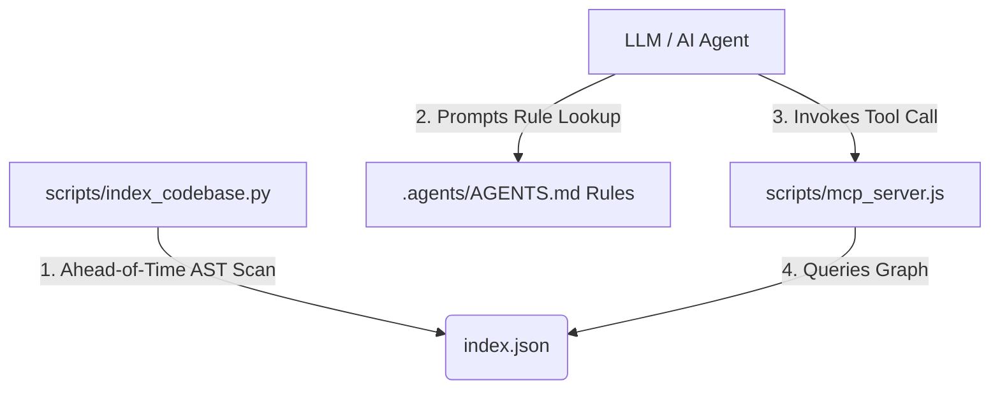

# Codebase Knowledge Graph & Indexing Architecture

This guide details the Codebase Knowledge Graph & Indexing Architecture, explaining why traditional search tools (like `grep` and `find`) waste tokens, how this system is implemented, and how to configure agents to prioritize the graph first.

---

### Part 1: Why Traditional Search Wastes Tokens

When an AI agent interacts with a codebase, it typically relies on one of two lookup strategies:

1. **Full-Text Searches** (`grep`, `find`, or command-line scans): The agent runs a recursive text search across files. The terminal outputs massive chunks of text containing matching keywords. This introduces token waste, polluting the context window with raw matching lines, irrelevant hits, and files the agent has no need to modify.
2. **Semantic Vector Search (Retrieval):** The system chunks the code and retrieves sections with high embedding similarity. However, this misses the structural topology (e.g., if a method interface is defined in file A but implemented in file B, semantic search might retrieve only file A because the keywords differ). The agent must then open and read multiple files to construct the relation map manually, ballooning token usage.

#### The Knowledge Graph Alternative

A Knowledge Graph models the codebase as a network:
- **Nodes:** Files, Classes, Methods, Endpoints, or UI Components.
- **Edges (Links):** Structural relationships such as `defines`, `inherits`, `references`, or `calls`.

Instead of loading raw text, the agent queries the graph (using tools like `search_symbols` or `get_symbol_relations`). It receives a compact JSON payload containing only structural node IDs and references (a few hundred bytes), instantly telling it exactly which files to read or edit.

---

### Part 2: Detailed Implementation Architecture

This project implements this architecture using three core layers:



#### 1. The Indexer: `index_codebase.py`
This script runs ahead-of-time (AOT) to parse the syntax of `.cs` and `.razor` files:
- It skips compiled artifacts, build outputs, and config folders (e.g., `bin/`, `obj/`, `.git/`).
- It scans file contents using regular expressions and bracket-matching code to extract classes and methods along with their signatures.
- It records references to known classes inside other files (creating edges).
- It outputs the graph state into a static, optimized JSON payload at `index.json`.

#### 2. The Bridge (MCP Server): `mcp_server.js`
This native Node.js script implements the Model Context Protocol (MCP), listening on `stdin`/`stdout` using JSON-RPC 2.0. It exposes two tools to the agent:
- `search_symbols(query)`: Finds nodes (files, classes, methods) whose names match the query.
- `get_symbol_relations(id)`: Returns the target node details, its dependencies (outgoing edges), and which files reference it (incoming edges).

#### 3. Server Registration: `mcp_config.json`
To register the server so the LLM agent can access these tools, the agent CLI configuration points to the Javascript file:

```json
{
  "mcpServers": {
    "medical-app-knowledge-graph": {
      "command": "node",
      "args": ["/workspaces/RodneyPortfolio/scripts/mcp_server.js"]
    }
  }
}
```

---

### Part 3: Forcing the Agent to Prioritize the Graph

To prevent the AI agent from defaulting to brute-force terminal searches, we write a behavioral constraint layer (representing "firmware instincts" for the agent) in `.agents/AGENTS.md`.

The agent loads these workspace rules automatically at the start of every session. The key instructions that enforce this behavior are:

```markdown
## Codebase Search Strategy
- You have access to a local Model Context Protocol (MCP) server named `medical-app-knowledge-graph`.
- Whenever you need to locate files, symbols, classes, methods, or components, or understand their references and dependencies:
  1. ALWAYS use the `search_symbols` or `get_symbol_relations` tools FIRST.
  2. Do NOT perform recursive codebase text searches (e.g., `grep_search` or terminal command line searches) unless the knowledge graph does not contain the symbol.
  3. Prioritize analyzing files identified as direct neighbors in the graph.
```

#### How to Replicate this Behavior in Any Agent Environment

If you are setting up a new agent or IDE extension (such as Cursor, Cline, or a custom LLM pipeline):

1. **Host the MCP Server:** Run the Node.js bridge server locally or embed it within your development workspace environment.
2. **Add to System Prompt/Rules:** Inject the markdown rules (like the one above) into your agent's system prompt or configuration file (`.cursorrules`, `.agents/AGENTS.md`, or your environment's system instructions prompt).
3. **Execute AST indexing dynamically:** Run `python3 scripts/index_codebase.py` on file-save hooks, pre-commit hooks, or setup scripts to ensure the index data remains updated as your codebase changes.
