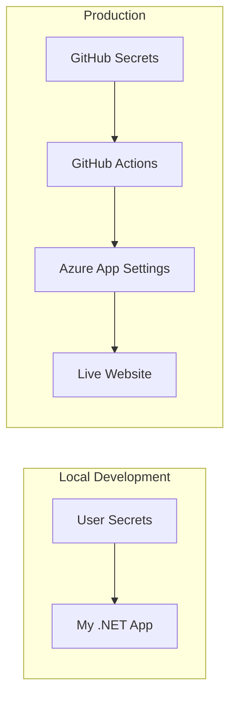
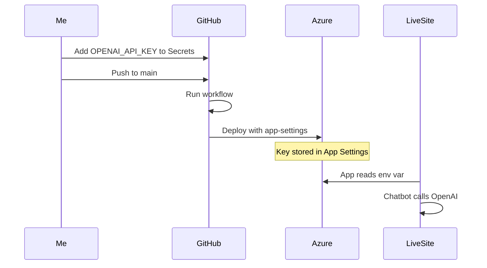

# How I Set Up My OpenAI API Key Safely

I configured my portfolio chatbot to use the OpenAI API without ever storing my key in my codebase. Here's how I did it—and how you can do the same.

---

## Why I Care About This

I never want my API key in a file that gets committed to Git. If someone gets my repo, they shouldn't get my key. I use **User Secrets** for local development and **GitHub Secrets + Azure App Settings** for production. The key flows from secure storage into my app at runtime—never from a config file in the repo.

---

## How the Key Flows (Overview)



| Environment | Where the Key Lives | How My App Gets It |
| ----------- | ------------------- | ------------------- |
| Local dev   | `~/.microsoft/usersecrets/` | `IConfiguration` reads User Secrets |
| Production  | GitHub Secrets → Azure App Settings | Azure injects as env var; `IConfiguration` reads it |

---

## Important: Revoke Exposed Keys First

If I ever shared my API key (chat, email, screenshot), I revoke it immediately:

1. Go to [platform.openai.com/api-keys](https://platform.openai.com/api-keys)
2. Find the exposed key
3. Click the trash icon to **revoke/delete** it
4. Create a **new** key and use that one everywhere

---

## Part 1: Local Development (User Secrets)

I use .NET User Secrets so my key stays on my machine and never touches the repo.

### Step 1: Open Terminal in My Project Folder

```bash
cd /Users/rodneyamoschery/dev/RodneyPortfolio
```

### Step 2: Store My API Key

I replace `YOUR_NEW_KEY_HERE` with my actual key from OpenAI:

```bash
dotnet user-secrets set "OpenAI:ApiKey" "YOUR_NEW_KEY_HERE"
```

### Step 3: Turn Off Demo Mode

I want the real API, not canned responses:

```bash
dotnet user-secrets set "OpenAI:UseDemoMode" "false"
```

### Step 4: Verify It Worked

```bash
dotnet user-secrets list
```

I expect to see:

- `OpenAI:ApiKey` = (my key, partially hidden)
- `OpenAI:UseDemoMode` = False

### Step 5: Run the App

```bash
dotnet run
```

I open the chatbot and ask a question. It uses the real OpenAI API.

### Where My Secrets Are Stored Locally

| OS      | Path |
| ------- | ---- |
| Mac/Linux | `~/.microsoft/usersecrets/a1b2c3d4-e5f6-4a7b-9c8d-1e2f3a4b5c6d/secrets.json` |
| Windows | `%APPDATA%\Microsoft\UserSecrets\a1b2c3d4-e5f6-4a7b-9c8d-1e2f3a4b5c6d\secrets.json` |

This file is **never** committed to Git.

---

## Part 2: Production (Azure Web App)

I deploy to Azure via GitHub Actions. My workflow injects the key during deployment.

### How It Works



### What I Did in My Workflow

I added `app-settings` to my Azure deploy step so the key gets passed in:

```yaml
- name: Deploy to Azure Web App
  uses: azure/webapps-deploy@v3
  with:
    app-name: 'rodney-portfolio'
    slot-name: 'Production'
    package: .
    app-settings: |
      OpenAI__ApiKey=${{ secrets.OPENAI_API_KEY }}
      OpenAI__UseDemoMode=false
```

### Steps I Follow to Add the Key for Production

1. Go to my repo: [github.com/ChefRod88/RodneyPortfolio](https://github.com/ChefRod88/RodneyPortfolio)
2. Click **Settings** → **Secrets and variables** → **Actions**
3. Click **New repository secret**
4. **Name:** `OPENAI_API_KEY`
5. **Value:** I paste my OpenAI API key (the new one, after revoking any exposed key)
6. Click **Add secret**

On the next push to `main`, the workflow deploys with the key. My live chatbot uses the real OpenAI API.

---

## How My .NET App Reads the Key

I don't hardcode anything. My `OpenAIChatService` reads from configuration:

```csharp
var apiKey = _config["OpenAI:ApiKey"];
var useDemoMode = _config.GetValue<bool>("OpenAI:UseDemoMode");

if (string.IsNullOrWhiteSpace(apiKey) || useDemoMode)
{
    return await GetDemoResponseAsync(userMessage, cancellationToken);
}
// Otherwise: call real OpenAI API with apiKey
```

| Source            | When It's Used |
| ----------------- | -------------- |
| User Secrets      | Development    |
| Azure App Settings | Production   |
| appsettings.json  | Fallback (I keep `ApiKey` empty there) |

---

## Quick Reference

| Task                    | Command or Action |
| ----------------------- | ----------------- |
| Set key locally         | `dotnet user-secrets set "OpenAI:ApiKey" "sk-..."` |
| Disable demo mode       | `dotnet user-secrets set "OpenAI:UseDemoMode" "false"` |
| List secrets            | `dotnet user-secrets list` |
| Add key for production  | GitHub → Settings → Secrets → `OPENAI_API_KEY` |
| Deploy                  | Push to `main` |

---

## Link to This Doc

I keep this guide in my repo so I can reference it anytime:

**[OpenAI API Key Setup (GitHub)](https://github.com/ChefRod88/RodneyPortfolio/blob/main/docs/OPENAI_API_KEY_SETUP.md)**
