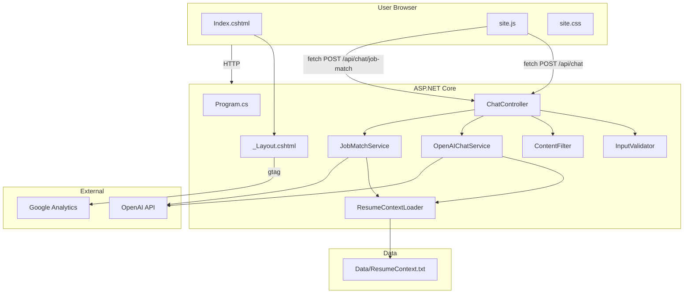
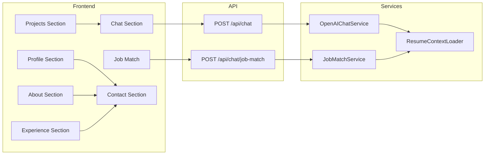

# Rodney Portfolio Website — Complete Technical Documentation

**Author:** Rodney Chery  
**Purpose:** I built this document to give recruiters, engineers, and hiring managers a full technical breakdown of my portfolio website. Every element, every decision, every line of code—I'm walking you through it all so you can see exactly what I built and how it works.

---

## Table of Contents

1. [Executive Summary](#1-executive-summary)
2. [Technology Stack](#2-technology-stack)
3. [Architecture Overview](#3-architecture-overview)
4. [Project Structure](#4-project-structure)
5. [Application Entry Point](#5-application-entry-point)
6. [Page Structure & HTML Breakdown](#6-page-structure--html-breakdown)
7. [CSS Architecture](#7-css-architecture)
8. [JavaScript Architecture](#8-javascript-architecture)
9. [API Layer](#9-api-layer)
10. [Services & Business Logic](#10-services--business-logic)
11. [Data Layer](#11-data-layer)
12. [Configuration & Secrets](#12-configuration--secrets)
13. [CI/CD Pipeline](#13-cicd-pipeline)
14. [Security](#14-security)
15. [Accessibility](#15-accessibility)
16. [PWA & Offline Support](#16-pwa--offline-support)

---

## 1. Executive Summary

I built rodneyachery.com as a single-page portfolio that showcases my background, skills, and projects. The site includes:

- **Profile/Hero** — Introduction with CV download and social links
- **About** — Education, photo collage, and career narrative
- **Experience** — Six skill cards (Soft Skills, IT Support, Frontend, Backend, Tools, AI/LLM)
- **Projects** — Two project cards (Ask Rodney AI Chatbot, GitHub repo)
- **Ask Rodney AI Chatbot** — Conversational AI that answers questions about my resume using OpenAI
- **Job Match** — Paste a job description and get a compatibility analysis
- **Contact** — Email and LinkedIn

The stack is **ASP.NET Core 10**, **Razor Pages**, **C#**, **JavaScript**, **Bootstrap**, and **OpenAI Chat Completions API**. I host it on **Azure Web App** with **GitHub Actions** CI/CD.

---

## 2. Technology Stack

| Layer | Technology | Version / Notes |
|-------|------------|-----------------|
| Runtime | .NET | 10.0 |
| Backend | ASP.NET Core | Razor Pages + Web API |
| Language | C# | Nullable reference types enabled |
| Frontend | HTML5, CSS3, JavaScript | Vanilla JS, no framework |
| UI Framework | Bootstrap | 5.x (via lib) |
| AI | OpenAI Chat Completions | gpt-4o-mini |
| Analytics | Google Analytics 4 | gtag.js |
| Hosting | Azure Web App | Production |
| CI/CD | GitHub Actions | Push to main triggers deploy |
| PWA | Service Worker | Offline caching |

---

## 3. Architecture Overview

### High-Level Data Flow



### Component Diagram



---

## 4. Project Structure

```
RodneyPortfolio/
├── .github/workflows/
│   └── main_rodney-portfolio.yml    # GitHub Actions: build + deploy to Azure
├── Controllers/
│   └── ChatController.cs           # REST API: /api/chat, /api/chat/job-match
├── Data/
│   └── ResumeContext.txt           # Resume + about content for AI context
├── Models/
│   ├── ChatRequest.cs              # { Message, Mode? }
│   ├── ChatResponse.cs             # { Reply }
│   ├── JobMatchRequest.cs          # { JobDescription }
│   └── JobMatchResponse.cs         # { MatchScore, SkillsAligned, Gaps, TalkingPoints }
├── Pages/
│   ├── Shared/
│   │   └── _Layout.cshtml          # Master layout, nav, footer, GA4, scripts
│   ├── Index.cshtml                # Main portfolio page (all sections)
│   ├── Index.cshtml.cs             # Page model
│   ├── Error.cshtml                # Error page
│   ├── Privacy.cshtml              # Privacy policy
│   ├── _ViewStart.cshtml           # Sets Layout
│   └── _ViewImports.cshtml         # Namespace imports, tag helpers
├── Services/
│   ├── IAIChatService.cs           # Interface for AI chat
│   ├── OpenAIChatService.cs        # OpenAI integration, prompt engineering, demo fallback
│   ├── IJobMatchService.cs         # Interface for job match
│   ├── JobMatchService.cs          # Job description analysis via OpenAI
│   ├── IResumeContextLoader.cs     # Interface for resume loader
│   ├── ResumeContextLoader.cs      # Loads Data/ResumeContext.txt, caches in memory
│   ├── InputValidator.cs           # Max length, prompt injection blocking
│   └── ContentFilter.cs            # Profanity block list
├── wwwroot/
│   ├── assets/
│   │   ├── images/                 # Profile photo, collage images
│   │   ├── icons/                  # SVG icons (LinkedIn, GitHub, checkmark, etc.)
│   │   └── resume/                 # Rodney Chery.pdf
│   ├── css/
│   │   └── site.css                # Custom styles (~1200+ lines)
│   ├── js/
│   │   └── site.js                 # Chatbot, job match, collage scroll, PWA
│   ├── sw.js                       # Service worker for PWA
│   ├── manifest.json               # PWA manifest
│   ├── favicon.ico
│   ├── favicon.svg
│   └── lib/                        # Bootstrap, jQuery
├── docs/                           # Documentation (this file and others)
├── Program.cs                      # Entry point, DI, middleware
├── appsettings.json                # OpenAI, GA4, logging
├── appsettings.Development.json    # Dev overrides
└── RodneyPortfolio.csproj          # .NET 10 project file
```

---

## 5. Application Entry Point

### Program.cs — What I Configure

**Dependency Injection:**
- `IResumeContextLoader` → `ResumeContextLoader` (scoped)
- `IAIChatService` → `OpenAIChatService` (scoped)
- `IJobMatchService` → `JobMatchService` (scoped)
- `IHttpClientFactory` for OpenAI API calls

**User Secrets:** In Development, I load User Secrets so the OpenAI API key is never committed. The key is read from `OpenAI:ApiKey`.

**Middleware Pipeline (in order):**
1. **Custom HTTPS/WWW redirect** — In production, I force `https://www.rodneyachery.com`. Localhost and 127.0.0.1 skip this.
2. **Exception handler** — In production, unhandled exceptions go to `/Error`.
3. **HSTS** — HTTP Strict Transport Security in production.
4. **HTTPS redirection**
5. **Routing**
6. **Authorization**
7. **Static assets** (Razor component static assets)
8. **Static files** (wwwroot)
9. **Controllers** (API routes)
10. **Razor Pages** (page routes)

---

## 6. Page Structure & HTML Breakdown

### 6.1 Master Layout (`_Layout.cshtml`)

| Element | Purpose |
|---------|---------|
| `@inject IConfiguration` | I inject configuration to read `GoogleAnalytics:MeasurementId` |
| `<!DOCTYPE html>` | HTML5 document |
| `<html lang="en">` | Language attribute for accessibility |
| `<head>` | Meta, PWA manifest, theme-color, Bootstrap, site.css, favicons |
| `@if (!string.IsNullOrWhiteSpace(gaId))` | I only render the GA4 gtag script when a Measurement ID is configured |
| `<script async src="...gtag/js?id=@gaId">` | Google Analytics 4 tracking script |
| `<body>` | Nav, main content, footer, scripts |
| `<nav id="hamburger-nav">` | Hamburger menu (logo + menu links) |
| `<main role="main">` | Main content area, `@RenderBody()` |
| `<footer>` | Nav links, copyright (year set by JS) |
| `<script src="~/lib/jquery/dist/jquery.min.js">` | jQuery (Bootstrap dependency) |
| `<script src="~/lib/bootstrap/dist/js/bootstrap.bundle.min.js">` | Bootstrap JS |
| `<script src="~/js/site.js" asp-append-version="true">` | My custom JavaScript with cache busting |

### 6.2 Index.cshtml — Section-by-Section

#### Section 1: Profile / Hero (`<section id="profile">`)

| Element | Tag | Classes / Attributes | Purpose |
|---------|-----|----------------------|---------|
| Container | `div` | `section__pic-container` | Wraps profile image |
| Profile image | `img` | `src="~/assets/images/IMG_75871.jpg"`, `alt`, `loading="lazy"` | My photo, lazy-loaded |
| Text container | `div` | `section__text` | Name, tagline, buttons |
| Greeting | `p` | `section__text__p1` | "Hello, I'm" |
| Name | `h1` | `title` | "Rodney Chery" |
| Tagline | `p` | `section__text__p2` | "People before process. Empathy before execution." |
| Button container | `div` | `btn-container` | Flex container for buttons |
| Download CV | `button` | `btn btn-outline-dark` | Opens `/assets/resume/Rodney%20Chery.pdf` in new tab |
| Contact Info | `button` | `btn btn-outline-dark` | Scrolls to `#contact` |
| Socials | `div` | `id="socials-container"` | LinkedIn, GitHub icons |
| LinkedIn icon | `img` | `icon` | `onclick` to LinkedIn |
| GitHub icon | `img` | `icon` | `onclick` to GitHub |

#### Section 2: About (`<section id="about">`)

| Element | Tag | Purpose |
|---------|-----|---------|
| Education card | `div` | `details-container education-card` — Pill-shaped card with WGU degree info |
| Section container | `div` | `section-container` — Flex layout for collage + text |
| Collage grid | `div` | `about-collage-grid` — 2×2 grid of 4 images |
| Collage images | `img` | `about-collage-img` — IMG_7753, IMG_7755, IMG_6985, IMG_77500 |
| Text container | `div` | `text-container` — About narrative (kitchens → tech, troubleshooting) |
| Arrow | `img` | `icon arrow` — Scrolls to `#experience` |

#### Section 3: Experience (`<section id="experience">`)

| Element | Purpose |
|---------|---------|
| `experience-details-container` | Wraps all skill rows |
| `experience-rows` | Row container |
| `experience-row experience-row-1` | First row: 3 cards |
| `experience-row experience-row-2` | Second row: 3 cards |
| `details-container skills-container` | Each skill card |
| `article-container` | Grid of skill items |
| `article` | Each skill: checkmark icon + `<h3>` + `<p>` (proficiency) |

**Skill cards:**

1. **Soft Skills** — Technical Communication, Cross-Functional Collaboration, Problem-Solving Under Pressure, Customer Empathy, Adaptability, Attention to Detail |
2. **IT Support Operations** — Enterprise Software Support, System Diagnostics, API/Integration Support, Customer-Focused Support, Escalation Management, Knowledge Base Management |
3. **Frontend Development** — HTML, CSS, JavaScript, TypeScript, Angular, Razor Pages |
4. **Backend Development** — C#, ASP.NET Core, Entity Framework Core, SQL Server, Git/GitHub, .NET MAUI |
5. **Tools** — Azure, Cursor, Docker |
6. **AI / LLM Development** — AI/LLM API Integration, Conversational Interfaces, Prompt Engineering, RESTful APIs & JSON, Input Validation & Filtering |

#### Section 4: Projects (`<section id="projects" class="projects-section">`)

| Element | Purpose |
|---------|---------|
| `projects-grid` | Flex container for project cards |
| **Card 1** — Ask Rodney AI Chatbot | |
| `a` | `project-card project-card-link`, `href="#ask-rodney"`, `aria-label` |
| `project-loader` | `div` — Contains loader animation |
| `span` | `loader loader-ai` — Custom black spinning gears animation |

| Element | Purpose |
|---------|---------|
| `project-btn` | Button text "Ask Rodney AI Chatbot" |
| `project-description` | Description paragraph |
| **Card 2** — GitHub | |
| `a` | `project-card project-card-link`, `href` to GitHub, `target="_blank"`, `rel="noopener noreferrer"` |
| `project-loader` | Contains default typewriter/cloud loader |
| `span` | `loader` — Base loader (no `loader-ai`) |
| `project-btn` | GitHub icon + "GitHub" text |

**Project card styling:** I use a 4px solid black border, gray background on the second card (for cloud visibility), and a light shadow on hover.

#### Section 5: Ask Rodney — AI Chatbot (`<section id="ask-rodney" class="chat-section">`)

| Element | ID / Class | Purpose |
|---------|------------|---------|
| Messages container | `#chat-messages` | `chat-messages`, `role="log"`, `aria-live="polite"` — Scrollable message list |
| Input | `#chat-input` | `chat-input`, `maxlength="500"`, `autocomplete="off"` |
| Send button | `#chat-send` | `chat-send-btn`, `aria-label="Send message"` |
| Character counter | `#chat-char-remaining` | Shows "500" initially, updates on input |
| Docs buttons | `chat-docs-btn-container` | Links to Documentation, Secure Open API Key Docs |
| Transparency panel | `chat-transparency-panel` | Collapsible "How this chatbot works" |
| Toggle button | `#chat-transparency-toggle` | `aria-expanded`, `aria-controls` |
| Content | `#chat-transparency-content` | `hidden` — Model, Architecture, Data, Safety, Hosting |
| Job Match | `chat-job-match` | Sub-section |
| Title | `chat-job-match-title` | "Job Match" |
| Textarea | `#job-match-input` | `chat-job-match-input`, `maxlength="4000"`, `rows="4"` |
| Character counter | `#job-match-char-remaining` | "4000" |
| Analyze button | `#job-match-analyze` | `chat-job-match-btn` |
| Result container | `#job-match-result` | `hidden` — Match score, skills, gaps, talking points |
| Score value | `#job-match-score-value` | Displays 0–100 |
| Lists | `#job-match-skills`, `#job-match-gaps`, `#job-match-talking` | `<ul>` elements — populated by JS |
| Job Match docs | `chat-docs-btn-container` | Link to Job Match Feature Technical Docs |

#### Section 6: Contact (`<section id="contact" class="contact-section">`)

| Element | Purpose |
|---------|---------|
| `contact-card` | Flex container |
| `contact-item` | Email link (`mailto:`) and LinkedIn link |
| `contact-icon` | Envelope SVG, LinkedIn SVG |

---

## 7. CSS Architecture

### 7.1 Organization

I use comment blocks to separate major sections:

- ROOT / TYPOGRAPHY
- FOCUS / ACCESSIBILITY
- PAGE / LAYOUT BASE
- PROFILE SECTION
- ABOUT SECTION
- EXPERIENCE SECTION
- PROJECTS SECTION
- CHAT SECTION
- JOB MATCH
- CONTACT
- RESPONSIVE

### 7.2 Key Design Tokens

| Token | Value | Usage |
|-------|-------|-------|
| Root font size | 14px (mobile), 16px (desktop) | Base font |
| `scroll-behavior` | smooth | Smooth scroll for anchor links |
| Body background | `#ffffff` | White |
| Profile title | `3rem`, `font-weight: 800` | Hero name |
| Card border | `4px solid #000000` | Project cards |
| Chat user message | Blue background | Right-aligned |
| Chat assistant message | Gray background | Left-aligned |

### 7.3 Project Card Loaders

**AI Card (`loader-ai`):** I use a custom spinning gears animation. Two pseudo-elements (`::before`, `::after`) create two circles with radial gradients for gear teeth. `--base-color: #000000` and `--tooth-color: #ffffff` give black gears with white teeth. `animation: rotationBack` — one gear 3s, the other 4s reverse.

**GitHub Card (default `loader`):** I use the base loader with a typewriter/crane-style animation. White circles and gray bars create a cloud-like appearance. The second card has a gray background (`#e5e7eb`) so the cloud outline is visible.

### 7.4 Responsive Breakpoints

- `768px` — Font size increase, layout adjustments
- `1100px` — Projects grid wraps
- Mobile — Hamburger menu, stacked layouts, full-width cards

---

## 8. JavaScript Architecture

### 8.1 Functions & Responsibilities

| Function | Purpose |
|----------|---------|
| `toggleMenu()` | Toggles `.open` on `.menu-links` and `.hamburger-icon` |
| `initAutoScrollCollage()` | Auto-scrolls `.about-collage-banner` (if present). Respects `prefers-reduced-motion`. Pauses on hover/touch/wheel. Uses `requestAnimationFrame`. |
| `initChatBot()` | Sets up chat UI, event listeners, transparency panel, job match |
| `addMessage(text, role)` | Creates `div.chat-message.{role}`, sets `textContent`, appends, scrolls |
| `setLoading(loading)` | Disables/enables input and send button |
| `sendMessage(text)` | POSTs `{ message }` to `/api/chat`, shows loading, renders reply or error |
| `updateCharCount()` | Updates `#chat-char-remaining` (500 - length) |
| `initJobMatch()` | Sets up job match UI |
| `renderList(ul, items)` | Clears `<ul>`, appends `<li>` for each item or "None" |
| `analyze()` | POSTs `{ jobDescription }` to `/api/chat/job-match`, renders results |
| `registerServiceWorker()` | Registers `/sw.js` for PWA |

### 8.2 Event Listeners

| Element | Event | Handler |
|---------|-------|---------|
| Send button | `click` | `sendMessage(inputEl.value)` |
| Chat input | `keydown` | Enter (no Shift) → `sendMessage` |
| Chat input | `input` | `updateCharCount` |
| Transparency toggle | `click` | Toggle `aria-expanded`, `hidden` on content |
| Job match input | `input` | `updateCharCount` |
| Analyze button | `click` | `analyze()` |

### 8.3 DOMContentLoaded

- Set copyright year: `document.getElementById("copyright").textContent = "Copyright © ${year} Rodney Chery..."`
- `initAutoScrollCollage()`
- `registerServiceWorker()`
- `initChatBot()` (which calls `initJobMatch()`)

### 8.4 XSS Prevention

I use `textContent` (not `innerHTML`) when rendering chat messages and job match list items. This prevents script injection.

---

## 9. API Layer

### 9.1 ChatController

**Route:** `[Route("api/[controller]")]` → `/api/chat`

**POST /api/chat**

| Step | Action |
|------|--------|
| 1 | Validate `request?.Message` not null |
| 2 | `InputValidator.GetValidationError(message)` → return 400 if invalid |
| 3 | `ContentFilter.IsBlocked(message)` → return 400 if blocked |
| 4 | `_aiService.GetReplyAsync(message.Trim(), request.Mode, cancellationToken)` |
| 5 | Return `{ reply }` or 500 on exception |

**Request body:** `{ "message": string, "mode"?: "recruiter" | "engineer" | "interview" }`  
**Response:** `{ "reply": string }`

**POST /api/chat/job-match**

| Step | Action |
|------|--------|
| 1 | Validate `request?.JobDescription` not null |
| 2 | Trim, check length > 0 |
| 3 | Check length ≤ 4000 |
| 4 | `_jobMatchService.AnalyzeAsync(trimmed, cancellationToken)` |
| 5 | Return `JobMatchResponse` or 500 on exception |

**Request body:** `{ "jobDescription": string }`  
**Response:** `{ matchScore, skillsAligned, gaps, talkingPoints }`

---

## 10. Services & Business Logic

### 10.1 OpenAIChatService

**Flow:**
1. Read `OpenAI:ApiKey` from config. If empty → return "The chatbot is not configured."
2. Load resume context via `IResumeContextLoader`.
3. Build system prompt with `BuildSystemPrompt(resumeContext, mode)`.
4. POST to `https://api.openai.com/v1/chat/completions` with `model`, `messages`, `max_tokens`.

**On API failure (401, 403, 429, 500, etc.):** I log the error and return a demo response via `GetDemoResponseAsync()` — keyword-based answers from resume context. The user never sees the raw API error.

**Prompt engineering:** I inject the current date for "how long at Canon" questions. I instruct the model to answer the specific question asked, vary response style, infer, calculate, and stay grounded in the context.

### 10.2 JobMatchService

**Flow:**
1. Read API key. If empty → return fallback with "Chatbot is not configured."
2. Load resume context.
3. Build prompt: "Compare this job description to Rodney Chery's resume. Return JSON: matchScore, skillsAligned, gaps, talkingPoints."
4. POST with `response_format: { type: "json_object" }`.
5. Parse JSON with `JsonDocument`, extract arrays via `GetStringArray()`.
6. `Math.Clamp(score, 0, 100)` for match score.

**On failure:** Return `MatchScore: 0`, `Gaps: ["Unable to analyze..."]` or `["Could not parse analysis..."]`.

### 10.3 ResumeContextLoader

- Reads `Data/ResumeContext.txt` from `ContentRootPath`.
- Caches in `_cachedContext` (in-memory, no expiration).
- Returns placeholder message if file not found.

### 10.4 InputValidator (Static)

- Max length: 500 characters.
- Blocked patterns: "ignore previous", "disregard", "system:", "you are now", "act as", etc.
- `IsValid()` → bool; `GetValidationError()` → string or null.

### 10.5 ContentFilter (Static)

- Blocked terms: profanity list with word-boundary regex.
- `IsBlocked()` → bool.

---

## 11. Data Layer

### ResumeContext.txt Structure

I maintain a plain-text file with:

- NAME & TITLE
- EDUCATION
- EXPERIENCE
- CAREER TRANSITION
- APPROACH TO TROUBLESHOOTING
- SOFT SKILLS
- TECHNICAL SKILLS
- PROJECTS
- PROJECT DEEP-DIVES (Portfolio Website, Ask Rodney Chatbot)
- WHAT DIFFERENTIATES RODNEY
- WORK PHILOSOPHY
- STRENGTHS IN TEAMS
- CONTACT

I update this file whenever my resume changes. The AI uses it as the sole source of truth.

---

## 12. Configuration & Secrets

### appsettings.json

```json
{
  "Logging": { "LogLevel": { "Default": "Information", "Microsoft.AspNetCore": "Warning" } },
  "AllowedHosts": "*",
  "OpenAI": { "ApiKey": "", "Model": "gpt-4o-mini" },
  "GoogleAnalytics": { "MeasurementId": "G-GFRJYMRHKM" }
}
```

### Secrets Management

- **Local:** `dotnet user-secrets set "OpenAI:ApiKey" "sk-..."` — never committed.
- **Production:** GitHub Secret `OPENAI_API_KEY` → Azure App Setting `OpenAI__ApiKey` via `Azure/appservice-settings@v1`.
- **GA4:** `GA4_MEASUREMENT_ID` in GitHub Secrets for production override; otherwise `appsettings.json` value is used.

---

## 13. CI/CD Pipeline

### .github/workflows/main_rodney-portfolio.yml

**Triggers:** Push to `main`, manual `workflow_dispatch`.

**Build job:**
- Checkout, setup .NET 10.x
- `dotnet build --configuration Release`
- `dotnet publish` to artifact
- Upload artifact

**Deploy job:**
- Download artifact
- Azure login (client-id, tenant-id, subscription-id from secrets)
- `azure/webapps-deploy@v3` → deploy to `rodney-portfolio`
- `Azure/appservice-settings@v1` → set `OpenAI__ApiKey`
- `Azure/appservice-settings@v1` → set `GoogleAnalytics__MeasurementId`

---

## 14. Security

| Measure | Implementation |
|---------|-----------------|
| API key storage | User Secrets (dev), GitHub Secrets → Azure (prod) |
| Input validation | 500 chars, prompt injection patterns blocked |
| Content filtering | Profanity block list |

| Measure | Implementation |
|---------|-----------------|
| XSS | `textContent` for user-generated content |
| HTTPS | Enforced in production |
| CORS | Default (same-origin) |
| Open redirect | N/A — no redirect from user input |

---

## 15. Accessibility

- `role="main"` on main content
- `role="log"` and `aria-live="polite"` on chat messages
- `aria-label` on send button, project cards
- `aria-expanded` and `aria-controls` on transparency toggle
- Semantic HTML (`section`, `article`, `h1`–`h4`)
- Focus styles for buttons and form controls

---

## 16. PWA & Offline Support

- **manifest.json** — App name, theme color, icons
- **sw.js** — Service worker caches static assets
- **registerServiceWorker()** — Registers on load, calls `reg.update()` for updates

---

## Summary

This document covers the full technical stack of my portfolio website: from the HTML structure and CSS classes to the C# services, API endpoints, configuration, and deployment flow. I built it to be a single, authoritative reference for anyone who wants to understand how rodneyachery.com works from A to Z.

---

**Document version:** 1.0  
**Last updated:** February 2026  
**Repository:** GitHub.com/ChefRod88/RodneyPortfolio
