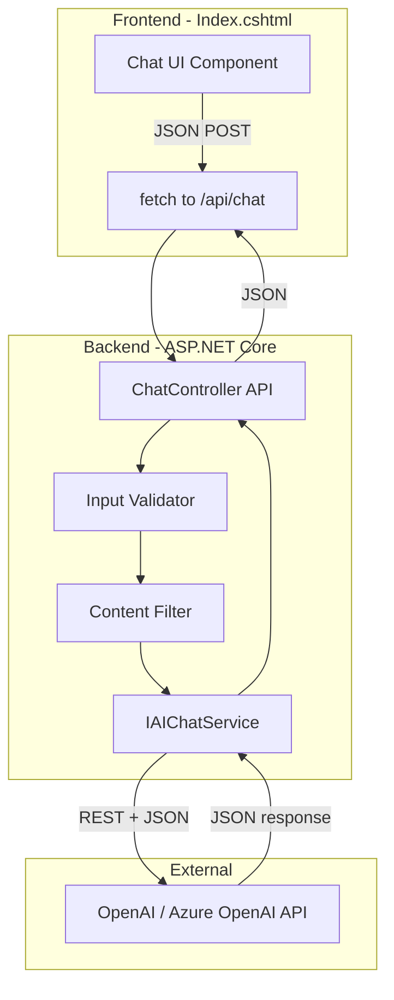

# Portfolio AI Skills Implementation Plan

## Chatbot Purpose: "Ask Rodney"

I built this chatbot as a **personal assistant** for my portfolio. Visitors can ask questions like:

- "What's Rodney's background?"
- "Tell me about his experience at Canon"
- "What skills does he have?"
- "What's his approach to troubleshooting?"
- "What's his education?"
- "Why did he transition from kitchens to tech?"

The AI uses my **resume content** and **About Me** section as its knowledge base to answer accurately and in my voice.

---

## Job Requirements Mapping

| Job Requirement                    | My Portfolio Implementation                                                       |
| ---------------------------------- | ---------------------------------------------------------------------------------- |
| Python, JS/TS, C#                  | C# backend + JavaScript frontend (I use ASP.NET Core)                              |
| RESTful APIs, JSON                 | Backend API controller calling OpenAI; JSON request/response handling              |
| Web app + UI design                | New chatbot section with modern conversational UI                                  |
| AI/LLM integration                 | Azure OpenAI or OpenAI API (I use OpenAI)                                         |
| Chatbots/conversational interfaces | "Ask Rodney" personal assistant chatbot                                            |
| Prompt engineering                 | System prompt with resume + about content; instructs AI to answer only about me   |
| AI safety                          | Input validation, content filtering, response guardrails, logging                  |

---

## Architecture Overview



---

## Step-by-Step Implementation Plan

### Step 1: Add NuGet Package and Configuration

**What I did:** I enabled HTTP calls to OpenAI/Azure OpenAI from C#.

**Files I created/modified:**

- [RodneyPortfolio.csproj](RodneyPortfolio.csproj) - I added the `OpenAI` NuGet package (or use HttpClient directly)
- [appsettings.json](appsettings.json) - I added `OpenAI:ApiKey` and `OpenAI:Model` (e.g., `gpt-4o-mini` for cost)
- [appsettings.Development.json](appsettings.Development.json) - Same keys; I use User Secrets for my real key

**Use case:** I store the API key securely. I support a "demo mode" when no key is set (return canned responses so the UI still works for visitors).

**Code concept:**

```csharp
// appsettings.json
"OpenAI": {
  "ApiKey": "",
  "Model": "gpt-4o-mini",
  "UseDemoMode": true  // When true and no key, I use mock responses
}
```

---

### Step 2: Create AI Chat Service (C#)

**What I did:** I encapsulated LLM API calls, prompt templates, and response handling. This demonstrates RESTful API consumption and JSON handling.

**Files I created:**

- `Services/IAIChatService.cs` - Interface
- `Services/OpenAIChatService.cs` - Implementation

**Use case:** When someone asks "What's Rodney's experience?" — my service injects my resume + about content into the system prompt and returns a natural, on-brand response.

**Data source:** I created a config file `Data/ResumeContext.txt` that I maintain with key resume points and about content. I update it when I update my resume. The service reads this and injects it into the system prompt.

**Code concept:**

```csharp
// I load my resume/about content (from Data/ResumeContext.txt or config)
var resumeContext = await _resumeContextLoader.LoadAsync();

// Prompt template (prompt engineering)
var systemPrompt = $@"You are a friendly assistant representing Rodney Chery. Your job is to answer questions about Rodney based ONLY on the following information. Do not make up facts. If asked something not covered below, say you don't have that information and suggest they check his resume or contact him.

--- RESUME & ABOUT CONTENT ---
{resumeContext}
--- END ---

Keep responses concise (2-4 sentences). Speak in third person about Rodney (e.g., 'He has...', 'Rodney brings...'). Be professional and warm.";

// REST call to OpenAI (simplified)
var response = await httpClient.PostAsJsonAsync(openAiUrl, new {
    model = "gpt-4o-mini",
    messages = new[] {
        new { role = "system", content = systemPrompt },
        new { role = "user", content = userMessage }
    }
});
var json = await response.Content.ReadFromJsonAsync<OpenAIResponse>();
```

**AI safety:** I log requests/responses (without PII), enforce max token limit, and validate response structure.

---

### Step 2b: Resume Context Data

**What I did:** I provided the AI with my resume and about content so it can answer accurately.

**Files I created:**

- `Data/ResumeContext.txt` - Plain text with key resume points, experience, skills, education, and about summary. I maintain this and update it when my resume changes.

**Content I included (from my portfolio):**

- Name, title (Technical Support Analyst)
- Education: B.S. Software Engineering (WGU), expected Dec 2026
- Experience: Canon IT Services (Technical Support Inkjet Tier 1), kitchen background
- Skills: C#, ASP.NET, SQL, JavaScript, troubleshooting, etc.
- About summary: kitchen-to-tech journey, troubleshooting approach, soft skills

**Use case:** When someone asks "What does Rodney do?", the LLM has this context and can answer: "Rodney is a Technical Support Analyst at Canon IT Services with a background in professional kitchens. He brings composure under pressure and disciplined troubleshooting to enterprise support."

---

### Step 3: Input Validation and Content Filtering

**What I did:** I implemented AI safety features: input validation, content filtering, and guardrails.

**Files I created:**

- `Services/InputValidator.cs` - I validate length and block injection patterns
- `Services/ContentFilter.cs` - I block inappropriate keywords

**Use case:** If someone pastes a 10,000-character string or attempts prompt injection — my validator rejects before calling the API.

**Code concept:**

```csharp
// InputValidator
- MaxLength: 500 characters
- Block patterns: "ignore previous", "system:", "disregard", etc.
- Trim and sanitize whitespace

// ContentFilter
- Block list: profanity, hate speech (configurable)
- Optional: flag potential PII (SSN, credit card) and reject
```

---

### Step 4: Chat API Controller

**What I did:** I created a RESTful endpoint that the frontend calls. It handles JSON request/response.

**Files I created:**

- `Controllers/ChatController.cs` - `POST /api/chat` with `ChatRequest` / `ChatResponse` DTOs

**Use case:** Frontend sends `{ "message": "What's Rodney's background?" }` → My controller validates, filters, calls `IAIChatService`, returns `{ "reply": "Rodney has a unique path from professional kitchens to tech..." }`.

**Code concept:**

```csharp
[HttpPost]
public async Task<IActionResult> Post([FromBody] ChatRequest request)
{
    if (!InputValidator.IsValid(request.Message))
        return BadRequest(new { error = "Invalid input" });
    if (ContentFilter.IsBlocked(request.Message))
        return BadRequest(new { error = "Message blocked" });
    
    var reply = await _aiService.GetReplyAsync(request.Message);
    return Ok(new ChatResponse { Reply = reply });
}
```

---

### Step 5: Chat UI Component (Frontend)

**What I did:** I built a conversational "Ask Rodney" interface. Clean, professional chat UI.

**Files I modified:**

- [Pages/Index.cshtml](Pages/Index.cshtml) - I added "Ask About Rodney" or "Chat with Rodney" section before Contact
- [wwwroot/css/site.css](wwwroot/css/site.css) - Styles for chat bubble, input, send button
- [wwwroot/js/site.js](wwwroot/js/site.js) - `fetch` to `/api/chat`, render messages, handle loading/errors

**Use case:** Visitor types "What's his experience?" → UI shows user message, loading state, then assistant reply in a chat bubble.

**Code concept (JavaScript):**

```javascript
async function sendMessage(text) {
  const res = await fetch('/api/chat', {
    method: 'POST',
    headers: { 'Content-Type': 'application/json' },
    body: JSON.stringify({ message: text })
  });
  const data = await res.json();
  if (!res.ok) throw new Error(data.error || 'Request failed');
  return data.reply;
}
```

**UI elements:** Message list (scrollable), text input, send button, suggested questions: "What's Rodney's background?", "Tell me about his experience", "What skills does he have?", "What's his education?"

---

### Step 6: Register Services and Wire Up

**What I did:** I set up dependency injection and routing.

**Files I modified:**

- [Program.cs](Program.cs) - I added `builder.Services.AddScoped<IAIChatService, OpenAIChatService>()`, `app.MapControllers()`

---

### Step 7: Update Skills Section

**What I did:** I aligned my portfolio with job posting language.

**Files I modified:**

- [Pages/Index.cshtml](Pages/Index.cshtml) - I added an "AI / LLM Development" skills card

**Skills I added:**

- AI/LLM API Integration (OpenAI, Azure OpenAI)
- Conversational Interfaces / Chatbots
- Prompt Engineering
- RESTful APIs & JSON
- Input Validation & Content Filtering

---

### Step 8: Add Project Card for AI Chatbot

**What I did:** I showcased the chatbot as a portfolio project.

**Files I modified:**

- [Pages/Index.cshtml](Pages/Index.cshtml) - I added project card in Projects section linking to the chatbot demo (anchor or same page)

---

### Step 9: Documentation

**What I did:** I created technical documentation (required by the job).

**Deliverables:**

- Inline code comments in `OpenAIChatService`, `ChatController`, validation/filter logic
- `docs/CHATBOT_API.md` - API spec (endpoint, request/response schema, error codes)
- Brief "How to use" in the chatbot UI (e.g., "Ask anything about Rodney—his background, experience, or skills")

---

### Step 10: Unit Tests (Required)

**What I did:** I created unit and integration tests for AI features (required by the job).

**Files I created:**

- `Tests/RodneyPortfolio.Tests.csproj` - xUnit project
- `Tests/InputValidatorTests.cs` - Test max length, block patterns
- `Tests/ContentFilterTests.cs` - Test block list
- `Tests/OpenAIChatServiceTests.cs` - Mock HTTP, test prompt construction and response parsing

---

## API Key and Demo Mode

- **Production:** I use Azure Key Vault or User Secrets; I never commit keys.
- **Demo mode:** When `ApiKey` is empty and `UseDemoMode` is true, I return predefined responses based on common question keywords (e.g., if question contains "experience" or "background", I return a short summary from my resume context). This lets the UI work for visitors even without an API key.

---

## Suggested Implementation Order

1. Step 1 (config) + Step 2b (ResumeContext.txt) + Step 2 (service with demo mode)
2. Step 3 (validation/filter) + Step 4 (controller)
3. Step 5 (UI)
4. Step 6 (DI/wiring)
5. Step 7 + 8 (skills + project card)
6. Step 9 (docs)
7. Step 10 (tests, required)

---

## Files Summary

| Action | Path                                                                                    |
| ------ | --------------------------------------------------------------------------------------- |
| Modify | `RodneyPortfolio.csproj`, `Program.cs`, `appsettings.json`                              |
| Create | `Services/IAIChatService.cs`, `Services/OpenAIChatService.cs`, `Data/ResumeContext.txt` |
| Create | `Services/InputValidator.cs`, `Services/ContentFilter.cs`                               |
| Create | `Controllers/ChatController.cs`, `Models/ChatRequest.cs`, `Models/ChatResponse.cs`      |
| Modify | `Pages/Index.cshtml`, `wwwroot/css/site.css`, `wwwroot/js/site.js`                      |
| Create | `docs/CHATBOT_API.md`                                                                   |
| Create | `Tests/` project and test classes                                                       |
